  

I'm a computer science student who learns by shipping. Most of what I build is backend work in Python: web apps with FastAPI and Django, bots, and small automations that run on a schedule. I write down what breaks along the way.

### Building on bdapps

  

[bdapps](https://bdapps.com) is Robi's app platform in Bangladesh: people sign in to an app with a phone-number OTP and pay for it from their mobile balance. I've wired its OTP, subscription and carrier-billing APIs into Django and FastAPI apps, handled the subscription callbacks, and built an agent that collects revenue from several developer accounts into one Telegram report every morning.

### Things I've built

**[PromptForge Academy](https://github.com/nafiz-byte/promptforge-academy)** &nbsp;·&nbsp; `FastAPI` `SQLAlchemy` `Jinja2` 
A seven-module prompt-engineering course as a web app. Lessons, quizzes, XP and a leaderboard, a PDF certificate on completion, OTP login and carrier billing through bdapps.

**[bdapps Revenue Agent](https://github.com/nafiz-byte/bdapps-agent)** &nbsp;·&nbsp; `Python` `requests` `pytest` `GitHub Actions` 
Signs in to several bdapps developer accounts every morning, pulls month-to-date revenue for each app, and sends one combined report to Telegram. It uses plain HTTP instead of a headless browser, so it also runs on shared hosting.

**[QuizFy](https://github.com/nafiz-byte/quizfy)** &nbsp;·&nbsp; `Django` `PostgreSQL` `OpenRouter` 
A Bangla quiz app where an LLM writes a fresh set of multiple-choice questions for each topic. Phone-number OTP sign-in, Robi subscription billing and a leaderboard.

**[nasaPics](https://github.com/nafiz-byte/nasaPics)** &nbsp;·&nbsp; `Streamlit` 
NASA's Astronomy Picture of the Day in a one-file web app.

### Stack

- **Use the most:** Python, FastAPI, Django, SQLite, Git, Linux
- **Getting better at:** PostgreSQL, Docker, AWS, data structures and algorithms
- **Also write:** C, Java

---

Found something broken in one of my repos? Open an issue. I'd rather hear about it.
